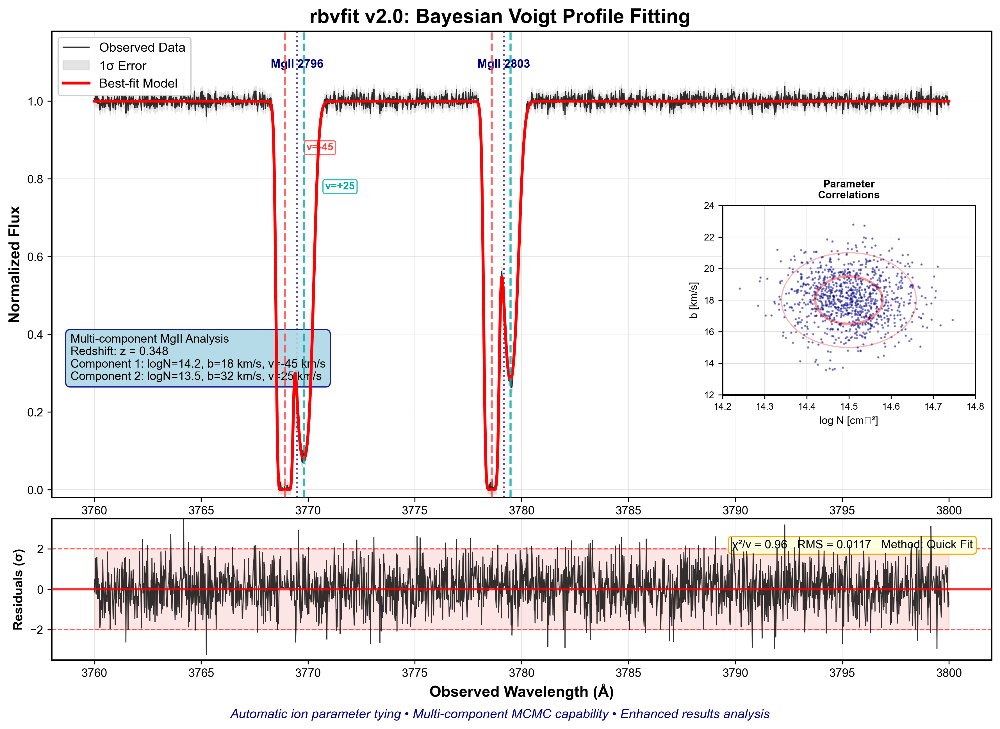

# rbvfit

[](https://doi.org/10.5281/zenodo.10403232)

**Bayesian Voigt Profile Fitting for Absorption Line Spectroscopy**

`rbvfit` performs forward modeling of absorption line spectra using Bayesian Voigt profile fitting. Version 2.0 introduces multi-system support, automatic ion parameter tying, multi-instrument joint fitting, and interactive parameter estimation tools. Version 2.0 is optimized for fast processing and uses [*emcee*](https://emcee.readthedocs.io/) or [*zeus*](https://zeus-mcmc.readthedocs.io/) MCMC samplers.

  
*Example: Multi-component MgII absorption line fit with `rbvfit`*

---

## 📋 Quick Navigation

| Section                | Link                                      |
|------------------------|-------------------------------------------|
| 🚀 Quick Start         | [Jump to Quick Start](#-quick-start)     |
| 💾 Installation        | [Jump to Installation](#installation)    |
| 🎮 Interactive Mode    | [Jump to Interactive Mode](#-interactive-mode) |
| 📚 Documentation       | [Jump to Documentation](#-documentation) |
| 📁 Examples            | [Jump to Examples](#-examples)           |

---
## Installation

### From source
```bash
git clone https://github.com/rongmon/rbvfit.git
cd rbvfit
python setup.py develop
```

**Alternative (modern pip)**:
```bash
git clone https://github.com/rongmon/rbvfit.git
cd rbvfit
pip install -e .
```
### Dependencies

- **Core**: numpy, scipy, matplotlib, emcee, corner
- **Interactive**: ipywidgets (Jupyter), tkinter/Qt (command-line)
- **Optional**: linetools (for COS-LSF), zeus (alternative MCMC sampler), h5py (results persistence)


## 🚀 Quick Start


# Basic usage
```python
import numpy as np
from rbvfit.core.fit_configuration import FitConfiguration
from rbvfit.core.voigt_model import VoigtModel
import rbvfit.vfit_mcmc as mc

# Set initial parameter guesses
nguess = [14.2, 14.5]  # log10(column density) in cm^-2
bguess = [40., 30.]    # Doppler parameter in km/s
vguess = [0., 0.]      # Velocity offset in km/s

# Setting the upper and lower limits for the fit
bounds, lb, ub = mc.set_bounds(nguess, bguess, vguess)

# Create configuration and fit
config = FitConfiguration()
config.add_system(z=0.348, ion='MgII', transitions=[2796.3, 2803.5], 
                  components=len(nguess))
model = VoigtModel(config)
theta = np.concatenate([nguess, bguess, vguess])
fitter = mc.vfit(model.compile(), theta, lb, ub, wave, flux, error)
fitter.runmcmc()

# Extract best-fit parameters
fitter.plot_corner() #First create corner plot
best_theta = fitter.best_theta  # Best-fit parameter array
best_N = best_theta[0:len(nguess)]  # Column densities
best_b = best_theta[len(nguess):2*len(nguess)]  # Doppler parameters  
best_v = best_theta[2*len(nguess):3*len(nguess)]  # Velocities
```


## 📚 Documentation

| Guide | Description | Level |
|-------|-------------|-------|
| [Quick Start Guide](docs/quick-start-guide.md) | Get your first fit running in 5 minutes | Beginner |
| [Interactive Mode Guide](docs/interactive-mode-guide.md) | **Interactive parameter estimation workflow** | **Beginner** |
| [User Guide](docs/user-guide.md) | Comprehensive workflow and concepts | Intermediate |
| [Tutorials](docs/tutorials.md) | Step-by-step examples with code | All levels |
| [Fitting Methods](docs/fitting-methods.md) | Quick fit vs MCMC comparison | Advanced |
| [Examples Gallery](docs/examples-gallery.md) | Visual showcase of capabilities | All levels |

## ✨ Key Features

- **🎯 Interactive Parameter Estimation**: Visual GUI for identifying components and setting initial guesses
- **Multi-System Support**: Fit multiple absorption systems simultaneously
- **Automatic Ion Tying**: Parameters shared correctly for same ions at same redshift
- **Multi-Instrument Fitting**: Joint analysis of data from different telescopes
- **Fast & Robust**: Both quick scipy fitting and full Bayesian MCMC
- **Rich Visualization**: Corner plots, velocity plots, convergence diagnostics
- **Cross-Platform**: Works in Jupyter notebooks and command-line environments

## 🎮 Interactive Mode

rbvfit 2.0 features an enhanced interactive parameter guessing system that makes initial parameter estimation intuitive and efficient:

### Visual Component Identification
```python
from rbvfit import guess_profile_parameters_interactive as g

# Launch interactive GUI
tab = g.gui_set_clump(wave_obs, flux, error, zabs=4.948, wrest=1548.5, xlim=[-600, 600])
```

**Interactive Controls:**
- **Left click** or `a` key: Add velocity guess at absorption features
- **Right click** or `r` key: Remove nearest velocity guess  
- **`q` or `ESC`**: Finish velocity selection

### Parameter Input Interface
```python
# Interactive parameter customization
tab.input_b_guess()  # GUI prompts for column density and Doppler parameters

# Extract parameters for fitting
nguess = tab.nguess  # log10(column density) in cm^-2
bguess = tab.bguess  # Doppler parameter in km/s
vguess = tab.vguess  # Velocity offsets in km/s
```

**Environment Support:**
- **Jupyter Notebooks**: Rich widget interface with inline plotting
- **Command Line**: Cross-platform matplotlib interaction
- **Remote Sessions**: Works with X11 forwarding and VNC

See the [Interactive Mode Guide](docs/interactive-mode-guide.md) for detailed workflow and advanced features.


## What's New in Version 2.0

| Feature                  | v1.0               | v2.0                          |
| ------------------------ | ------------------ | ----------------------------- |
| Interactive Tools        | ✗ Basic            | ✅ GUI with widget support     |
| Parameter Estimation     | ✗ Manual           | ✅ Visual + GUI guessing       |
| Environment Support      | CLI only           | ✅ CLI + Jupyter               |
| Multi-System Setup       | ✗ Manual config    | ✅ Ion-based auto setup        |
| Parameter Tying          | Single redshift    | ✅ Multi-redshift              |
| Multi-Instrument Fitting | 2 instruments max  | ✅ Full joint N-instrument fit |
| Fitting Methods          | emcee only         | ✅ emcee + zeus + curve\_fit   |
| Results Analysis         | Basic output       | ✅ Diagnostics + plots         |
| Data Persistence         | Manual             | ✅ HDF5 w/ metadata            |
| Code Architecture        | Monolithic         | ✅ Modular                     |
| Fitting Engine           | Standard           | ✅ Vectorized +optimized       |
|FWHM Velocity Conversion  | ✗ Manual handling  |✅ Automatic w/ instrument database|

## 📁 Examples

Explore working examples in [`src/rbvfit/examples/`](src/rbvfit/examples/):

- `example_voigt_model.py` - Basic model creation
- `example_voigt_fitter.py` - Single system fitting  
- `rbvfit2-single-instrument-tutorial.py` - Complete single dataset workflow
- `rbvfit2-single-instrument-interactive-tutorial.py` - **Interactive mode demonstration**
- `rbvfit2-multi-instrument-tutorial.py` - Joint fitting multiple datasets

## Description

**Main Modules (Version 2.0)**:

**Core Architecture (`rbvfit/core/`)**:
- **voigt_model.py**: Main model class for creating and evaluating Voigt profiles with automatic ion parameter tying
- **fit_configuration.py**: Configuration system for defining multi-system absorption setups
- **parameter_manager.py**: Handles parameter mapping between configurations and fitting arrays
- **fit_results.py**: Enhanced results management with HDF5 persistence and analysis capabilities
- **quick_fit_interface.py**: Fast scipy.optimize-based fitting interface

**Interactive Tools**:
- **guess_profile_parameters_interactive.py**: **Enhanced interactive parameter estimation with GUI support**

**Fitting Engine**:
- **vfit_mcmc.py**: MCMC fitter supporting emcee and zeus samplers for Bayesian parameter estimation

**Legacy Modules (Version 1.0 - still available)**:
- **model.py**: Original top-level code for complex multi-component/multi-species Voigt profiles
- **rb_vfit.py**: General code to create individual Voigt profiles
- **rb_setline.py**: Line properties reader using approximate rest wavelength guess
- **rb_interactive_vpfit.py**: Interactive Voigt profile fitter with least squares and MCMC options

**Key Version 2.0 Improvements**:
- **🎯 Enhanced Interactive Tools**: Visual component identification with cross-platform GUI support
- **Ion-specific model setup**: Clean configuration system with automatic ion detection and parameter organization
- **Enhanced multi-instrument support**: Full N-instrument joint fitting (v1.0 limited to 2 instruments)  
- **Multi-redshift parameter tying**: Automatic parameter sharing for same ions across different redshift systems
- **Multiple fitting algorithms**: Support for emcee, zeus (MCMC) and scipy curve_fit (quick fitting)
- **Advanced results analysis**: Comprehensive fit diagnostics, convergence analysis, and publication-quality visualization
- **HDF5 persistence**: Complete save/load functionality for complex fitting results
- **Modular architecture**: Clean separation between models, fitting, and analysis components

## 🎯 Typical Workflow

### 1. Interactive Parameter Estimation
```python
from rbvfit import guess_profile_parameters_interactive as g

# Visual component identification
tab = g.gui_set_clump(wave, flux, error, zabs, wrest=1548.5)
tab.input_b_guess()  # Interactive parameter input
```

### 2. Model Configuration
```python
from rbvfit.core.fit_configuration import FitConfiguration
from rbvfit.core.voigt_model import VoigtModel

config = FitConfiguration()
config.add_system(z=zabs, ion='CIV', transitions=[1548.2, 1550.3], 
                  components=len(tab.nguess))
model = VoigtModel(config)
```

### 3. MCMC Fitting
```python
import rbvfit.vfit_mcmc as mc

theta = np.concatenate([tab.nguess, tab.bguess, tab.vguess])
bounds, lb, ub = mc.set_bounds(tab.nguess, tab.bguess, tab.vguess)

fitter = mc.vfit(model.compile(), theta, lb, ub, wave, flux, error)
fitter.runmcmc()
```

### 4. Results Analysis
```python
from rbvfit.core import fit_results as f

results = f.FitResults(fitter, model)
results.print_fit_summary()
results.corner_plot()
results.plot_velocity_fits()
```

## Citation

If you use rbvfit in your research, please cite:

[](https://doi.org/10.5281/zenodo.10403232)

## Support

- **Issues**: [GitHub Issues](https://github.com/rongmon/rbvfit/issues)
- **Interactive Mode Help**: See [Interactive Mode Guide](docs/interactive-mode-guide.md)

**Note**: 
- **Version 1.0**: Written By: Rongmon Bordoloi. July 2019. Tested on: Python 3.7+
- **Version 2.0**: Enhanced by: Rongmon Bordoloi. 2025. Tested on: Python 3.8+

## 

This project is licensed under the [MIT License](LICENSE).
