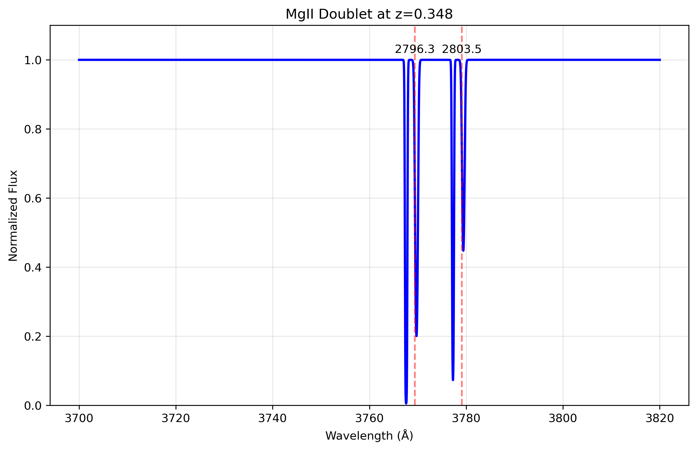
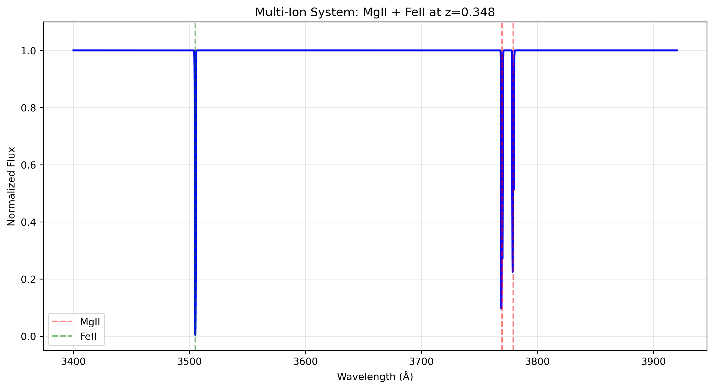

# Examples Gallery

[← Back to Main Documentation](../README.md)

Visual showcase of rbvfit2 capabilities with example outputs and use cases.

## Gallery Overview

This gallery demonstrates the range of absorption line systems rbvfit2 can analyze, from simple single-component fits to complex multi-instrument joint analysis.

---

## 1. Basic Model Creation

**Example**: [`example_voigt_model.py`](../src/rbvfit/examples/example_voigt_model.py)

### MgII Doublet at z=0.348


*Figure: Basic MgII doublet synthetic spectrum*


**Use Case**: Understanding Voigt profile shapes and doublet ratios

**Key Features**:
- Automatic doublet ratio (2:1 for MgII)
- Component velocity separation
- Instrumental convolution effects

---

## 2. Multi-Ion Systems

**Example**: [`example_voigt_model.py`](../src/rbvfit/examples/example_voigt_model.py) - Multi-ion function

### FeII + MgII at Same Redshift

*Figure: Multiple ion species absorption*


**Use Case**: Multi-phase absorption analysis

**Key Features**:
- Automatic parameter tying for same redshift
- Multiple transition families
- Physical velocity component sharing

---

## 3. Single System Fitting

**Example**: [`example_voigt_fitter.py`](../src/rbvfit/examples/example_voigt_fitter.py)

### SiII + HI Absorption Fit

*Figure: Complete fitting workflow result*
```
Expected plot: Three-panel figure showing:
Top: Data (black) vs model (red) with residuals
Middle: Individual component contributions
Bottom: Residuals with chi-squared statistics
```

**Use Case**: Standard single-system absorption line fitting

**Key Features**:
- Multi-transition fitting
- Component decomposition
- Residual analysis
- Parameter uncertainty visualization

### Parameter Corner Plot

*Figure: MCMC parameter correlations*
```
Expected plot: Corner plot matrix showing:
- Parameter distributions (diagonal)
- Parameter correlations (off-diagonal)  
- Confidence contours (1σ, 2σ, 3σ)
- Best-fit values marked
```

**Use Case**: Understanding parameter degeneracies and uncertainties

---

## 4. Multi-Component Analysis

**Example**: [`rbvfit2-single-instrument-tutorial.py`](../src/rbvfit/examples/rbvfit2-single-instrument-tutorial.py)

### 3-Component CIV System

*Figure: Complex velocity structure*
```
Expected plot: Multi-panel showing:
- Overall fit with 3 velocity components
- Individual component profiles
- Velocity space representation
- Component parameter table
```

**Use Case**: Resolving complex kinematic structure

**Key Features**:
- Multiple velocity components
- Component velocity determination
- Kinematic interpretation
- Individual component properties

### Convergence Diagnostics

*Figure: MCMC chain analysis*
```
Expected plot: Multi-panel chain traces showing:
- Parameter evolution vs MCMC step
- Burn-in period identification
- Chain mixing assessment
- Autocorrelation analysis
```

**Use Case**: Verifying MCMC convergence quality

---

## 5. Multi-Instrument Joint Fitting

**Example**: [`rbvfit2-multi-instrument-tutorial.py`](../src/rbvfit/examples/rbvfit2-multi-instrument-tutorial.py)

### XShooter + FIRE Joint Analysis

*Figure: Multi-instrument comparison*
```
Expected plot: Comparison figure showing:
- XShooter data (higher resolution)
- FIRE data (lower resolution) 
- Joint best-fit model
- Residuals for each instrument
- Combined chi-squared statistics
```

**Use Case**: Combining data from different telescopes/instruments

**Key Features**:
- Shared physical parameters
- Different instrumental resolutions
- Joint uncertainty estimation
- Cross-validation between datasets

### Velocity Space Analysis

*Figure: Ion-specific velocity plots*
```
Expected plot: Velocity-space representation showing:
- Absorption profiles in velocity coordinates
- Component positions marked
- Multiple ions overlaid
- Kinematic interpretation aids
```

**Use Case**: Physical interpretation of absorption kinematics

---

## 6. Complex Multi-System

**Example**: [`rbvfit2-multi-instrument-tutorial2.py`](../src/rbvfit/examples/rbvfit2-multi-instrument-tutorial2.py)

### CIV + OI + SiII Multi-Redshift System

*Figure: Complete contamination analysis*
```
Expected plot: Multi-panel complex system showing:
- Full spectral range with multiple systems
- Individual system contributions
- System-by-system decomposition
- Redshift identification
```

**Use Case**: Analyzing complex contaminated absorption

**Key Features**:
- Multiple redshift systems
- Different ion species
- Automatic line identification
- Contamination handling

### System Decomposition

*Figure: Individual system analysis*
```
Expected plot: System-by-system breakdown showing:
- CIV system at z=4.95 (background)
- OI system at z=6.07 (foreground)
- SiII system at z=6.07 (foreground)
- Parameter sharing within redshift groups
```

**Use Case**: Understanding complex absorption line regions

---

## 7. Quick vs MCMC Comparison

**Example**: Mixed from fitting method examples

### Speed vs Quality Trade-off

*Figure: Method comparison*
```
Expected plot: Side-by-side comparison showing:
- Quick fit results (left panels)
- MCMC fit results (right panels)
- Parameter value comparison
- Uncertainty comparison
- Computational time comparison
```

**Use Case**: Choosing appropriate fitting method

**Key Insights**:
- Quick fit: seconds, approximate uncertainties
- MCMC fit: minutes, robust uncertainties
- Parameter values typically agree
- MCMC provides correlation information

---

## 8. Results Analysis Showcase

### Comprehensive Results Summary

*Figure: Publication-quality results presentation*
```
Expected plot: Multi-panel summary showing:
- Best-fit spectrum with model overlay
- Parameter table with uncertainties
- Corner plot with correlations
- Residual analysis with chi-squared
- Component decomposition
- Velocity structure analysis
```

**Use Case**: Publication-ready absorption line analysis

**Key Features**:
- Professional visualization
- Complete uncertainty analysis
- Physical interpretation aids
- Exportable parameter tables

---

## 9. Error Analysis Examples

### Uncertainty Propagation

*Figure: Error analysis demonstration*
```
Expected plot: Error visualization showing:
- Parameter uncertainty distributions
- Correlated vs uncorrelated errors
- Confidence intervals on model
- Bootstrap comparison
- Systematic error assessment
```

**Use Case**: Understanding and reporting uncertainties

**Key Features**:
- Full posterior sampling
- Confidence interval calculation
- Error propagation to derived quantities
- Robust uncertainty estimation

---

## 10. Advanced Visualization

### Interactive Results Exploration

*Figure: Advanced plotting capabilities*
```
Expected plot: Enhanced visualization showing:
- Velocity plots by ion species
- Component identification markers
- Interactive parameter exploration
- Model component toggles
- Residual inspection tools
```

**Use Case**: Detailed results exploration and interpretation

**Key Features**:
- Ion-specific analysis
- Component identification
- Interactive exploration
- Publication-quality outputs

---

## Common Plot Types

### 1. Spectral Fits
**What**: Data vs model comparison
**When**: All fitting examples
**Interpretation**: Visual assessment of fit quality

### 2. Corner Plots  
**What**: Parameter correlations and distributions
**When**: MCMC fitting examples
**Interpretation**: Parameter degeneracies and uncertainties

### 3. Chain Traces
**What**: MCMC convergence assessment
**When**: Long MCMC runs
**Interpretation**: Sampling quality and burn-in

### 4. Residual Analysis
**What**: Data - model differences
**When**: All fitting examples  
**Interpretation**: Systematic deviations and fit quality

### 5. Velocity Plots
**What**: Absorption in velocity space
**When**: Multi-component systems
**Interpretation**: Kinematic structure

### 6. Component Decomposition
**What**: Individual velocity component contributions
**When**: Multi-component fits
**Interpretation**: Physical component properties

---

## Figure Generation Guide

### Running Examples to Generate Figures

```bash
# Navigate to examples directory
cd src/rbvfit/examples/

# Basic model creation
python example_voigt_model.py
# Generates: MgII doublet, multi-ion system plots

# Single system fitting
python example_voigt_fitter.py  
# Generates: Fit results, corner plot, convergence diagnostics

# Complex system analysis
python rbvfit2-single-instrument-tutorial.py
# Generates: Multi-component CIV analysis

# Multi-instrument fitting
python rbvfit2-multi-instrument-tutorial.py
# Generates: Joint fitting results, velocity plots

# Complex multi-system
python rbvfit2-multi-instrument-tutorial2.py
# Generates: Multi-redshift system analysis
```

### Customizing Output

```python
# Save figures instead of displaying
import matplotlib.pyplot as plt
plt.savefig('my_fit_result.pdf', dpi=300, bbox_inches='tight')

# Customize figure size and quality
plt.figure(figsize=(12, 8))
# ... plotting commands ...
plt.savefig('publication_figure.pdf', dpi=300)

# Export parameter tables
results.export_parameter_table('fit_parameters.txt')
results.save('complete_results.h5')  # Save everything
```

### Expected File Outputs

After running examples, expect to generate:

**Plots**:
- `spectrum_fit.pdf` - Data vs model comparison
- `corner_plot.pdf` - Parameter correlations
- `convergence.pdf` - MCMC diagnostics
- `velocity_plots.pdf` - Kinematic analysis
- `residuals.pdf` - Fit quality assessment

**Data Files**:
- `fit_results.h5` - Complete results package
- `parameters.txt` - Parameter table
- `model_spectrum.txt` - Best-fit model spectrum

---

## Use Case Matrix

| System Type | Complexity | Example File | Key Features |
|-------------|------------|--------------|--------------|
| Single ion, 1 component | Simple | `example_voigt_model.py` | Basic concepts |
| Single ion, 2 components | Moderate | `example_voigt_fitter.py` | Multi-component |
| Multi-ion, same z | Moderate | `example_voigt_model.py` | Parameter tying |
| Single ion, multi-component | Complex | `rbvfit2-single-instrument-tutorial.py` | Kinematic analysis |
| Multi-instrument | Complex | `rbvfit2-multi-instrument-tutorial.py` | Joint fitting |
| Multi-system | Very Complex | `rbvfit2-multi-instrument-tutorial2.py` | Contamination |

---

## Interpretation Guide

### Reading Spectral Fits

**Good Fit Indicators**:
- Model (red) closely follows data (black)
- Residuals scattered around zero
- χ²/ν ≈ 1.0
- No systematic patterns in residuals

**Poor Fit Indicators**:
- Large systematic deviations
- χ²/ν >> 1.0 or << 1.0
- Obvious patterns in residuals
- Model doesn't capture line shapes

### Understanding Corner Plots

**Parameter Distributions**:
- Diagonal: Marginalized parameter distributions
- Narrow peaks: Well-constrained parameters
- Broad distributions: Poorly constrained parameters
- Multiple peaks: Multi-modal posteriors

**Parameter Correlations**:
- Off-diagonal: Joint parameter distributions
- Diagonal patterns: Strong correlations
- Circular contours: Uncorrelated parameters
- Curved contours: Non-linear correlations

### Velocity Plot Interpretation

**Physical Meaning**:
- X-axis: Velocity relative to systemic redshift
- Y-axis: Normalized flux (1.0 = continuum)
- Absorption depth: Column density
- Line width: Doppler parameter
- Line center: Velocity offset

**Kinematic Structure**:
- Multiple components: Distinct velocity systems
- Broad lines: High turbulence or temperature
- Narrow lines: Low turbulence, possibly thermal
- Velocity separation: Kinematic relationship

---

## Best Practices for Figure Generation

### For Publications

1. **High Resolution**: Use `dpi=300` or higher
2. **Vector Formats**: PDF preferred over PNG for scalability
3. **Clear Labels**: Ensure axis labels and units are clear
4. **Color Blind Friendly**: Use distinguishable colors
5. **Consistent Style**: Match journal requirements

### For Analysis

1. **Interactive Plots**: Use for exploration
2. **Multiple Views**: Generate various plot types
3. **Save Intermediate**: Keep analysis checkpoints
4. **Document Parameters**: Include parameter values in plots
5. **Version Control**: Save both plots and generating code

---

## Troubleshooting Figure Generation

### Common Issues

**No plots appear**:
```python
import matplotlib
matplotlib.use('TkAgg')  # or 'Qt5Agg'
import matplotlib.pyplot as plt
plt.show()  # Ensure this is called
```

**Poor plot quality**:
```python
plt.figure(figsize=(10, 8))  # Larger figure size
plt.savefig('plot.pdf', dpi=300, bbox_inches='tight')
```

**Memory issues with large datasets**:
```python
# Downsample for plotting
plot_indices = np.arange(0, len(wave), 10)  # Every 10th point
plt.plot(wave[plot_indices], flux[plot_indices])
```

---

## Interactive Examples

### Jupyter Notebook Integration

```python
# For interactive exploration
%matplotlib widget
import ipywidgets as widgets

# Interactive parameter adjustment
@widgets.interact(N=(12.0, 16.0, 0.1), b=(5.0, 100.0, 5.0), v=(-200.0, 200.0, 10.0))
def plot_model(N=13.5, b=25.0, v=0.0):
    theta = [N, b, v]
    model_flux = model.evaluate(theta, wave)
    plt.figure(figsize=(10, 6))
    plt.plot(wave, flux, 'k-', label='Data')
    plt.plot(wave, model_flux, 'r-', label='Model')
    plt.legend()
    plt.show()
```

### Real-time Parameter Exploration

```python
# Live updating plots during MCMC
def plot_progress(sampler, step):
    if step % 100 == 0:
        current_samples = sampler.get_chain()
        plt.clf()
        plt.plot(current_samples[:, :, 0].T, alpha=0.3)
        plt.ylabel('Parameter 0')
        plt.xlabel('Step')
        plt.title(f'MCMC Progress: Step {step}')
        plt.pause(0.1)
```

---

[← Back to Main Documentation](../README.md) | [← Back to Tutorials](tutorials.md)