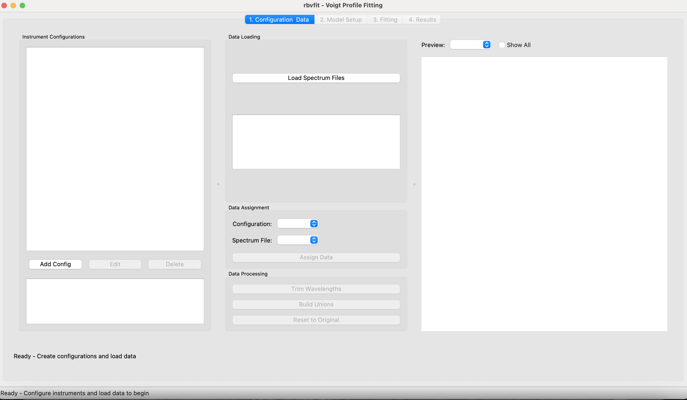
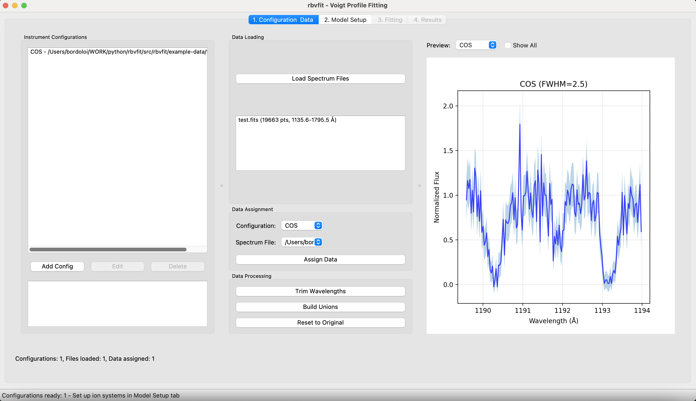
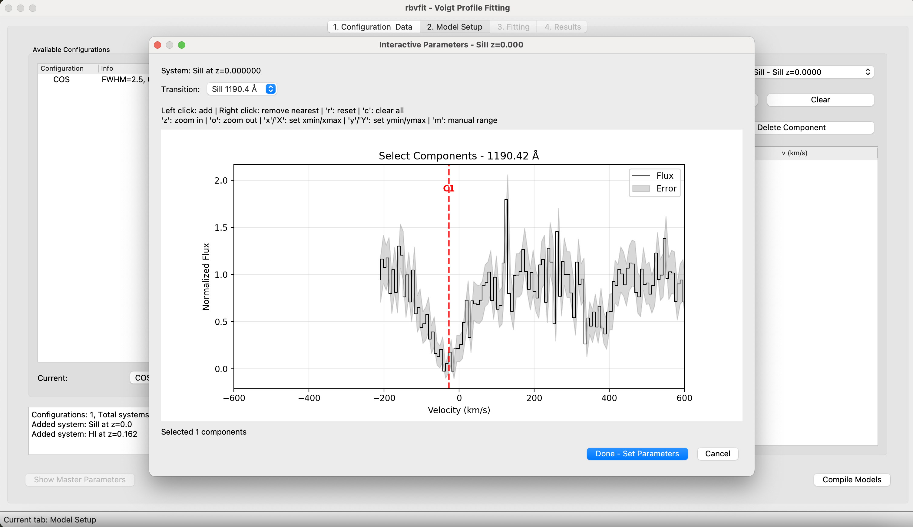
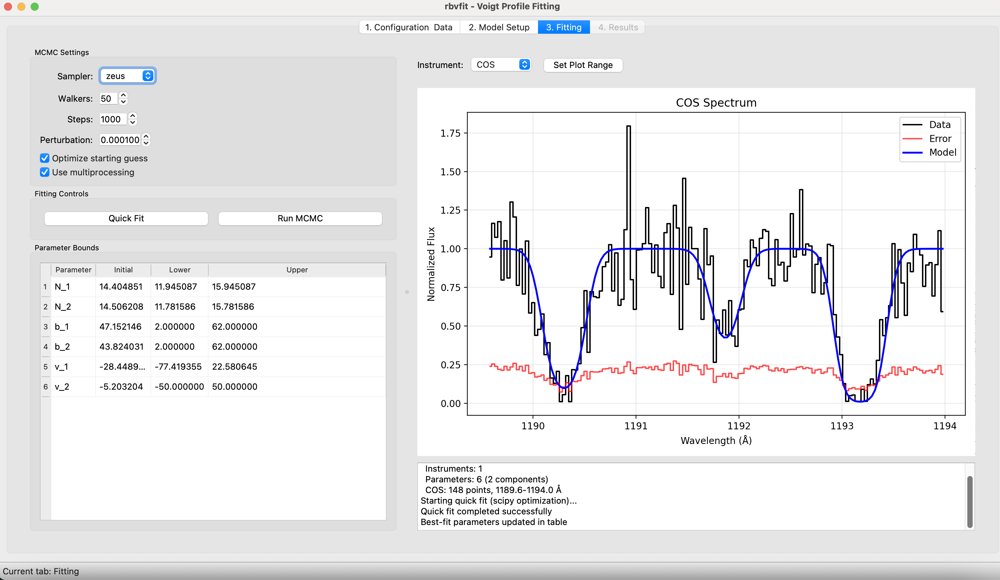
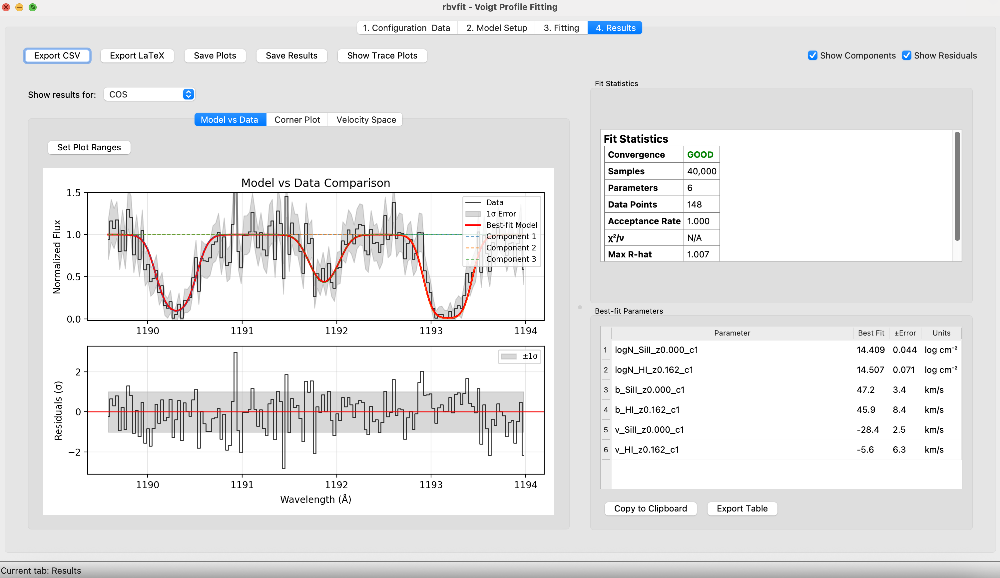

# rbvfit GUI Tutorial
[← Back to Main Documentation](../README.md)

This guide provides an overview of the rbvfit graphical user interface (GUI) for analyzing absorption line spectra. The GUI simplifies the process of setting up instrument configurations, loading data, defining ion systems, performing MCMC fitting, and analyzing results.
## Quick Start

Launch the GUI from the command line:
> ```bash
># Start with empty session
> rbvfit_gui
> # Or load an existing project
> rbvfit_gui project.rbv
> ```

> ```bash
># Show all options
> rbvfit_gui --help
>```

The interface follows a 4-tab workflow: **Data → Model → Fitting → Results**



## Configuration & Data (Tab 1)

### Create Instrument Configurations
1. Click "Add Configuration" to create a new instrument setup
2. Enter configuration name (e.g., "COS_G130M", "UVES")
3. Set the instrumental FWHM in km/s
4. Add optional description

### Load and Process Spectra
1. Click "Load Files" to select spectrum files
2. Assign loaded files to configurations using dropdown menus
3. Use wavelength trimming to focus on absorption features
4. Validate data before proceeding to model setup



*Tip: Start with a single spectrum covering one absorption system for your first analysis.*

## Model Setup (Tab 2)

### Add Ion Systems
1. Select a configuration from the dropdown
2. Click "Add System" to create new absorption systems
3. Enter system redshift and add ion species (CIV, HI, MgII, etc.)
4. Set velocity components for each ion
5. Add all systems to the same configuration to share across instruments

*Tip: Configure absorbers once - automatically applied to all instruments.*

### Parameter Estimation
1. If there are multiple systems, first select the system from the parameter estimation dropdown menu.
2. Use the interactive estimation tools to set initial parameter guesses
3. Adjust column densities (N), Doppler parameters (b), and velocities (v)
4. Repeat for each system as needed 
4. Click "Compile Models" when ready to proceed



*Tip: Use single components initially, then add complexity as needed.*

## Fitting & Results (Tabs 3-4)

### MCMC Fitting (Tab 3)
1. Review compiled models and parameter bounds
2. Adjust initial parameters and bounds as needed 
3. Choose sampler (emcee or zeus) and set number of walkers/steps
4. Click "Start Fitting" to begin MCMC analysis
5. Monitor convergence diagnostics during the run



### Analyze Results (Tab 4)
1. View parameter tables with uncertainties
2. Examine corner plots for parameter correlations
3. Compare model fits to data with residuals
4. Export results in CSV, JSON, or LaTeX formats
5. Export resuts and fitting details as hdf5 files for further analysis. Use it with Unified_results.py 



*Tip: Check that parameter chains have converged before interpreting results.*

## Project Management

### Save/Load Sessions
- **Save Project (Ctrl+S)**: Preserves configurations, ion systems, and parameters
- **Load Project (Ctrl+O)**: Restores complete analysis session
- Projects are saved as .rbv files containing metadata only (not raw data)

*Note: When loading projects, you may need to reassign data files if paths have changed.*

## Tips

**Getting Started:**
- Begin with simple single-line fits to learn the interface
- Use the parameter estimation tools before running MCMC fits
- Start with fewer MCMC steps for initial testing

**Best Practices:**
- Always check convergence diagnostics in the fitting tab
- Use realistic parameter bounds based on physical expectations
- Save projects frequently to preserve your work

**Multi-instrument Analysis:**
- Create separate configurations for each instrument with appropriate FWHM values
- Ion systems are automatically shared across all configurations
- Joint fitting improves parameter constraints significantly

**Troubleshooting:**
- If fitting fails to converge, try adjusting initial parameter guesses
- For large datasets, consider using fewer walkers or the zeus sampler
- Check that spectrum files are properly formatted with wavelength, flux, and error columns